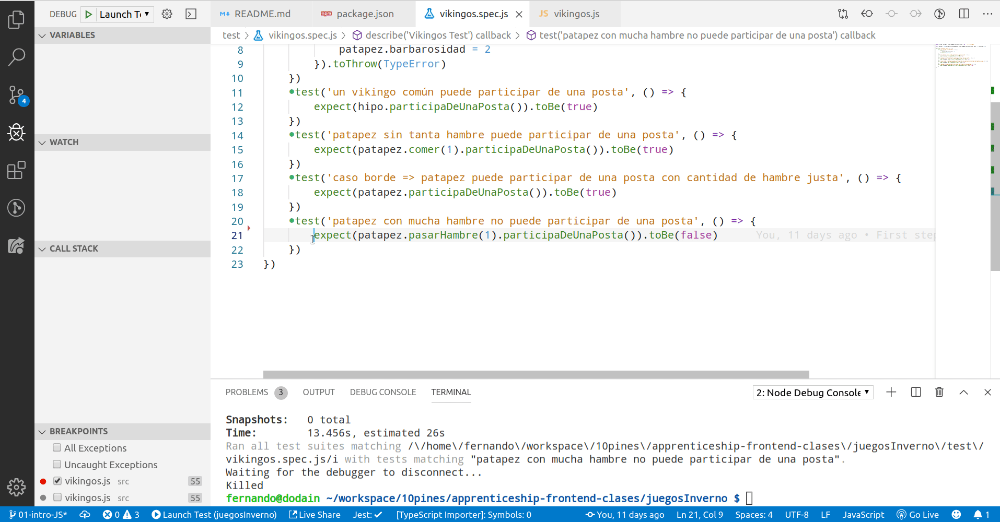

# Juegos de inverno

[](https://www.travis-ci.org/fdodino/vikingos-js)

## Entorno para trabajar

- Instalar [node](https://nodejs.org/es/), la versión estable (10.16.13 LTS)
- Instalar [npm](https://www.npmjs.com/), el manejador de versiones de Node: tenés que [crear una cuenta](https://www.npmjs.com/signup) y bajártelo. Para más información leete [este artículo](http://wiki.uqbar.org/wiki/articles/npm-dependencias.html)
- Instalar [Visual Studio Code](https://code.visualstudio.com/)
- Agregarle las siguientes extensions:
  - [ESLint](https://marketplace.visualstudio.com/items?itemName=dbaeumer.vscode-eslint): para detectar errores de javascript
  - [Live Share](https://marketplace.visualstudio.com/items?itemName=MS-vsliveshare.vsliveshare): para pairear remoto (y tener acceso al control de tu máquina)
  - [JEST](https://marketplace.visualstudio.com/items?itemName=Orta.vscode-jest): para correr o debuggear directamente desde Visual Studio Code
  - [Jest Runner](https://marketplace.visualstudio.com/items?itemName=firsttris.vscode-jest-runner), para tener menúes de Run y Debug de tests
  - [Autoimport](https://marketplace.visualstudio.com/items?itemName=steoates.autoimport)
  - [Git Lens](https://marketplace.visualstudio.com/items?itemName=eamodio.gitlens): un cliente (más) para manejarse con git.
- si quieren probar un [Tabnine, autocompleter loco](https://marketplace.visualstudio.com/items?itemName=TabNine.tabnine-vscode) ahí lo tienen para descargar

## Para ejecutar este ejemplo

1. Tienen que bajarse las dependencias, al igual que con las gemas de Ruby o las dependencias de Maven. Se van al directorio raíz desde donde lo descargaron y ejecutan:

```bash
npm install
```

El `package.json` es lo que determina qué paquetes usa tu proyecto: se descargarán los módulos necesarios en la carpeta `node_modules`.

2. Con el plugin de JEST directamente se posicionan en la suite o en algún test y lo ejecutan, o lo debuggean (tienen que instalar la versión 10.16.3 de Node o similar)



## Archivos de configuración

No tienen que configurar nada, pero está bueno saber que están

- `.eslintrc` ==> es el que define las reglas del Linter
- `.gitignore` ==> para no agregar el directorio `.history`, ni `node_modules`
- `babel.config.js` ==> configuración de Babel para transpilar código que escribieron a una versión más vieja de Javascript soportada por a) navegadores, b) versiones de node anteriores.

El transpiler es necesario para poder utilizar la sintaxis de módulos en JS, así como para soportar features experimentales que no son parte del estándar ES6 (soportado por la mayoría de los navegadores).
También se asegura que puedas escribir ES6 (por ejemplo, clases o lambdas como una función que suma 1 a un número: `(numero) => numero + 1`) convirtiendolo a un código retrocompatible (por ejemplo para IE):


- `.markdownlint.json` ==> no lo necesitan, es solo para configurar las reglas de este README
- `jest.config.json` ==> está vacío, es la configuración de JEST, un framework para testeo unitario (el RSpec de Ruby/ JUnit de Java que conocen)

## Algo sobre Javascript

- Es un lenguaje de programación y también de [scripting](https://en.wikipedia.org/wiki/Scripting_language) (para automatizar tareas, como Bash, Python o Ruby)
- Corre en una VM de Javascript, como... un navegador o bien en node en nuestro caso
- No tiene chequeo estático de tipos (solo dinámico)
- No está basado en clases, sino en prototipos, como [self](http://www.selflanguage.org/), [Ioke](https://en.wikipedia.org/wiki/Ioke_(programming_language)), entre otros. Para más información podés leer [esta página](http://wiki.uqbar.org/wiki/articles/resumen-lenguajes-prototipados.html).

## Enunciado 0.1 de los vikingos

Un torneo consta de 3 postas principales:

- **Pesca**: en esta posta es mejor el competidor que más pescado logre cargar. Sabemos que un vikingo puede cargar un máximo de kilos de pescado equivalente al 50% de su peso + el doble de su barbarosidad. Luego de participar en una posta de pesca los vikingos incrementan 5% de su nivel de hambre.
- **Combate**: se considera mejor el competidor a aquel que posea la mayor barbarosidad. Cuando un vikingo participa de un combate incrementa en 10% su nivel de hambre.
- **Carrera**: dados dos competidores, el mejor para una carrera es aquel que sea más veloz. Al participar de este tipo de posta los vikingos incrementan 1% de hambre por cada km de carrera.

Para este torneo estarán participando los siguientes vikingos:

- **Hipo**: pesa 80kg, alcanza una velocidad de 13 km/h y tiene un nivel de barbarosidad de 10. 
- **Astrid**: pesa 130kg, alcanza una velocidad de 10 km/h y tiene un nivel de barbarosidad de 7.
- **Patán**:  pesa 100kg, alcanza una velocidad de 15 km/h y tiene un nivel de barbarosidad de 13.
- **Patapez**: pesa 70kg, alcanza una velocidad de 7 km/h y tiene un nivel de barbarosidad de 1. Es un chico muy inteligente pero poco deportivo. 

1. Postas!

Hacer que varios participantes participen en una posta, para esto hay que ver quienes pueden participar. Cada posta posee ciertos criterios de admisión que dependen del tipo de posta:

- **Pesca**: Puede existir o no un requerimiento de peso mínimo que debe levantar un participante.
- **Combate**: Debe tener al menos un grado de barbaridad mínimo.
- **Carrera**: No tiene requerimientos.

## Resolviendo el punto 1

Nos concentraremos primero en el punto 1: hacer que los vikingos participen en una posta. Esto depende principalmente de la posta, polimorfismo mediante, comenzamos pensando en nuestro primer test, necesitamos

- como precondiciones: una posta carrera, y un vikingo poco fuerte
- como acciones: el vikingo poco fuerte quiere participar de la carrera, que no tiene restricciones
- como condiciones a cumplir: debe poder

```js
describe('Postas Test', () => {
  test('cualquier vikingo puede participar de una carrera', () => {
    expect(carrera.puedeParticipar(vikingoPocoFuerte)).toBeTruthy()
  })
})
```

¿Cómo implementamos al vikingo poco fuerte? Como un objeto puro:

```js
const vikingoPocoFuerte = {
  barbarosidad: 0,
  peso: 40
}
```

Y la carrera, como otro objeto:

```js
export const carrera = {
  puedeParticipar: function(participante) { return true }
}
```

Un objeto javascript tiene **slots**:

- en el caso del vikingo poco fuerte, tenemos atributos como la barbarosidad o el peso
- en el caso de la carrera, vemos que un slot también puede referenciar a una función, es el equivalente al método que nosotros conocemos. No, no son exactamente iguales pero se parecen bastante y a los fines prácticos los vamos a tratar en forma similar.

En javascript tenemos varios formatos para definir funciones:

```js
const laVerdad = parametro => true            // arrow functions en su versión más concisa, un parametro y un retorno inline
const laVerdad = (parametro, otro) => { return true } // arrow functions que permiten varios parametros y cuerpo de función
function laVerdad(parametro) { return true }    // formato de función tradicional
```
Invocamos a una función a través de los paréntesis:

```js
laVerdad(1) // ==> devuelve true
laVerdad()  // ==> oia! también devuelve true, porque no usamos para nada el parametro
```
Les recomendamos leer [esta página](https://www.freecodecamp.org/news/when-and-why-you-should-use-es6-arrow-functions-and-when-you-shouldnt-3d851d7f0b26/) para sacarse las dudas cada vez que vuelvan sobre ésto (y van a volver, créannos).

A partir de ahora, vamos a usar otro syntactic sugar para indicar que un slot es una función, que es más simple:

```js
export const carrera = {
  puedeParticipar(participante) { // no hace falta el :function() {}
    return true
  }
}
```

Este test que acabamos de definir es lo que Martin Fowler llamaría [test solitario](https://martinfowler.com/bliki/UnitTest.html), no necesitamos definir un vikingo posta por el momento, porque solo queremos probar la funcionalidad de nuestra posta de carrera.

## Segunda implementación: posta de combate

Para la posta de combate, tenemos que separar dos clases de equivalencia:

- vikingos que tienen el grado de barbarosidad justo para competir
- vikingos que tienen justo un grado menos de barbarosidad y no pueden participar

Para ello vamos a reutilizar el vikingo fuerte y poco fuerte del test de carrera, y lo vamos a anidar dentro de nuestro tests:

```js
describe('Postas Test', () => {
  let vikingoBarbaro
  let vikingoNoTanBarbaro

  beforeEach(() => {
    vikingoBarbaro = {
      barbarosidad: 10,
      peso: 80
    }
    vikingoNoTanBarbaro = {
      barbarosidad: 9,
      peso: 40
    }
    combate.gradoBarbaridadRequerido = 10  // encapsulamiento, quién te conoce
  })
  test('cualquier vikingo puede participar de una carrera', () => {
    expect(carrera.puedeParticipar(vikingoNoTanBarbaro)).toBeTruthy()
  })
  test('un vikingo con nivel de barbarosidad suficiente puede participar de un combate', () => {
    expect(combate.puedeParticipar(vikingoBarbaro)).toBeTruthy()
  })
  test('un vikingo con nivel de barbarosidad insuficiente no puede participar de un combate', () => {
    expect(combate.puedeParticipar(vikingoNoTanBarbaro)).toBeFalsy()
  })
})
```

El `beforeEach` nos permite envolver cosas que queremos hacer antes de llamar a cada test, como inicializar nuevamente los valores de un vikingo o un combate (para que no haya **efecto colateral**, así los tests son independientes y repetibles).

La implementación de combate sigue siendo un objeto con dos slots: el atributo `gradoBarbaridadRequerido` y la función `puedeParticipar`.

```js
export const combate = {
  gradoBarbaridadRequerido: 0,
  puedeParticipar(participante) {
    return participante.barbarosidad >= this.gradoBarbaridadRequerido
  }
}
```

Ya tenemos polimorfismo entre objetos... ¿lo notaron?

```js
    expect(carrera.puedeParticipar(vikingoNoTanBarbaro)).toBeTruthy()
    expect(combate.puedeParticipar(vikingoBarbaro)).toBeTruthy()
    expect(combate.puedeParticipar(vikingoNoTanBarbaro)).toBeFalsy()
```


## Agregados: los vikingos

Ahora necesitamos saber si un vikingo puede participar de una posta:

- Todos los vikingos pueden participar en una posta si cumplen los requisitos de dicha posta.
- Hipo puede participar en una posta si su nivel de barbarosidad es >= 10.
- Patapez no puede participar en una posta si su hambre supera 50% y le da el doble de hambre que al resto participar de una posta. Por eso, come cada vez que termina de participar en una posta bajando su nivel de hambre en 20%.

### Objetos o clases

Ahora necesitamos definir los vikingos, donde

- todos van a tener los mismos atributos
- todos (independientemente de que agreguen o no condiciones) deben delegar a la posta para preguntar si pueden participar de ella

Podemos seguir trabajando con objetos:

```js
const vikingoDefault = {
  puedeParticiparDeUnaPosta(posta) {
    return posta.puedeParticipar(this)
  }
}

export const hipo = {
  __proto__: vikingoDefault,
  nombre: 'Hipo',
  velocidad: 13,
  barbarosidad: 10,
  peso: 80,
  hambre: 0,
  puedeParticiparDeUnaPosta(posta) {
    return this.barbarosidad >= 10 && super.puedeParticiparDeUnaPosta(posta)
  },
}
```

De esta manera:

- `__proto__` funciona como un objeto prototipo, delegamos en él la parte común a todos los vikingos
- si el comportamiento default de Astrid es delegar a la posta, definimos su prototipo y esto permite que todo método no definido se delegue automáticamente al prototipo:

```js
export const astrid = {
  peso: 130,
  velocidad: 10,
  barbarosidad: 7,
  __proto__: vikingoDefault
}
```


Pero el **prototype chain** de Javascript suele ser bastante áspero de movida, entonces vamos a recalcular y dejarles este [apunte de Diseño en Javascript 5](https://docs.google.com/document/d/16uezoafdWPm0XC8NsA2HUib6lUDkFiStUfEIH2x7ysU/edit) por si quieren jugar un poco.

## Ok, vamos por las clases

Esto se va a parecer más a lo que conocen. Astrid y Patán serán instancias de una clase Vikingo. ES6 (la especificación ECMAScript 6) introdujo un syntactic sugar de clase:

```js
class Vikingo {

  // para qué un constructor con los parámetros
  // 1. me aseguro que construir un objeto sea una operación atómica (no queda en
  // estado inconsistente)
  // 2. Tomo sólo las propiedades que me interesan, de otra manera podrian sobreescribirme los slots correspondientes a métodos!
  constructor({ peso, velocidad, barbarosidad }) {
    this.nivelDeHambre = 0
    Object.assign(this, { peso, velocidad, barbarosidad })
  }

  puedeParticiparDeUnaPosta(posta) {
    return posta.puedeParticipar(this)
  }

  participaDeUnaPosta(posta) {
    return this.puedeParticiparDeUnaPosta(posta)
  }
}
```

Una clase tiene

- un constructor (y solo uno)
- métodos (`this` tal cual lo conocemos de Java)

En esta implementación, nosotros le pasamos un objeto, y lo que estamos haciendo es generar una copia de Vikingo con las propiedades que le pasamos en el constructor:

Paso 0) todo objeto Vikingo tiene hardcodeado this.nivelDeHambre => 0
Paso 1) a esta instancia le asignamos los parámetros recibidos que nos interesan

Vemos cómo se instancia en el test:

```js
// además me exporto objetos instanciados a partir de una clase como constantes
export const astrid = new Vikingo({ peso: 130, velocidad: 10, barbarosidad: 7 })
export const patan = new Vikingo({ peso: 100, velocidad: 15, barbarosidad: 13 })
```

Por otra parte, Patapez va a ser subclase de Vikingo, para redefinir el hook method que calcula la posibilidad de que participe de una posta:

```js
    test('patapez con hambre justa puede participar de una posta', () => {
        patapez.nivelDeHambre = NIVEL_HAMBRE_LIMITE_PATAPEZ
        expect(patapez.participaDeUnaPosta()).toBeTruthy()
    })
    test('patapez con mucha hambre no puede participar de una posta', () => {
        patapez.nivelDeHambre = NIVEL_HAMBRE_LIMITE_PATAPEZ + 1
        expect(patapez.participaDeUnaPosta()).toBeFalsy()
    })
```

Un dato curioso: ¿por qué este test funciona?

```js
    test('lcdtmjs!', () => {
        patapez.nivelHambre = 10000000000000
        expect(patapez.participaDeUnaPosta()).toBeTruthy()
        // por qué? por qué? adivinalo
    })
```

## Tarea para el hogar

Completar los tests que faltan y seguir con el [enunciado completo](https://docs.google.com/document/d/1X6hsA9FuhwxJvQio-JBGHx19cae1dxV9BHN-W5vLX8w/edit#), sin tomar en cuenta este requerimiento:

> Inmutability-galore

Es decir, saltéense ese paso.
